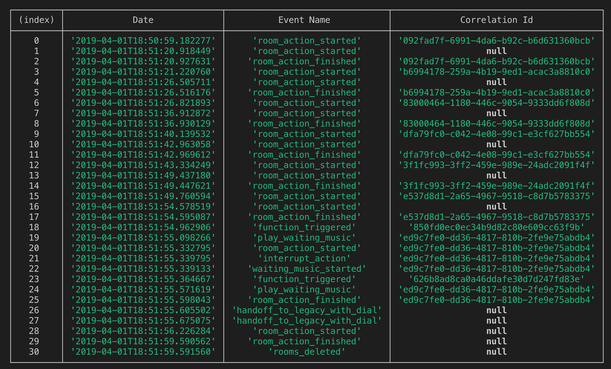

# Logentries Improvements for Talkdesk

## How to use

`$ yarn build`
`$ yarn start`

You can write directly the logs on the terminal or write it in a file and redirect the stdin/stdout. After an empty line or end of file, the output will be shown.

Available commands:

- `$ node dist/Bin/Logs.js timeline`
- `$ node dist/Bin/Logs.js -r timeline` (if you want to see the event payload)
- `$ node dist/Bin/Logs.js sort` (only sorts the logs)
- `$ node dist/Bin/Logs.js query --query "where(/bla/ OR /bla1/ OR /bla2/) -hours 24"` (get list of logs -> is better redirect the output to a file using `> file.out`)

# Configurations

## .env file

Constants that have to be defined on a `.env` file.

| Variable                                      | Description                                                                      |
| --------------------------------------------- | -------------------------------------------------------------------------------- |
| **LOGENTRIES_API_KEY_LOG_ID**                 | { "key_id_1": "log_id_1", "key_id_2": "log_id_2" ...}                            |
|                                               |                                                                                   |