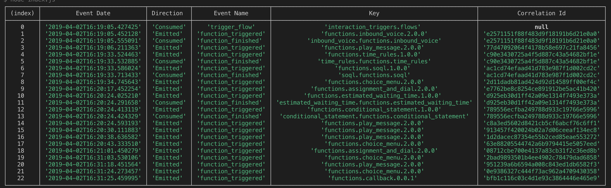

# Logentries Improvements for Talkdesk

## How to use

`$ yarn build`
`$ yarn start`

You can write directly the logs on the terminal or write it in a file and redirect the stdin/stdout. After an empty line or end of file, the output will be shown.

Available commands:

- `$node dist/Bin/Logs.js timeline`
- `$node dist/Bin/Logs.js -r timeline` (if you want to see the event payload)
- `$node dist/Bin/Logs.js sort` (only sorts the logs)

